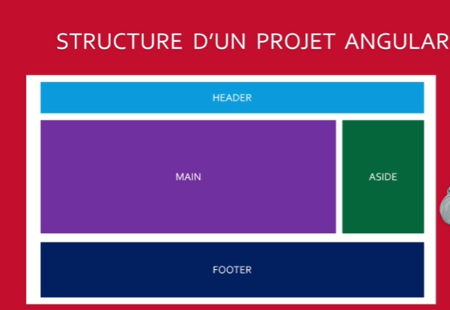

ng generate components/header
ng g c components/header
ng g c components/header; components/Main; components/Aside; components/Container
Strutura di un progetto Angular
npm install bootstrap
ng add @ng-bootstrap/ng-bootstrap
ng add @angular/material
ng g service services/book 
ng g c components/books

